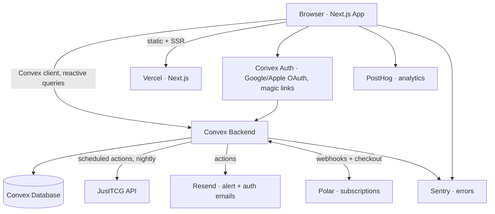

# PRD: Kiri

## 1. Overview

### Product Summary

**Kiri** helps collectors track, value, and trade their TCG collection across every game. Collectors search any card across Magic: The Gathering, Pokémon, Yu-Gi-Oh!, and Sorcery: Contested Realm, add holdings with condition, printing, quantity, and cost, and get a living portfolio: total value, daily movement, P&L, price history charts, and alerts that watch the market overnight. Trading is in the product's future (and its name) but not in this PRD's scope.

### Objective

This PRD covers the MVP defined in `product-vision.md` § Product Strategy: card catalog + search, public card pages with price history, portfolio with P&L, price alerts, watchlist, accounts with free-tier limits, Polar subscriptions, and the nightly snapshot engine. Target: buildable in 6-8 weeks of part-time work by one founder using Claude Code, on top of the completed design system in `docs/design.md`.

### Market Differentiation

Kiri's position is "portfolio, not inventory": real financial mechanics (cost basis, unrealized P&L, movers, history) in a crafted editorial interface, across all four games at once. Technically this demands three things competitors don't deliver together: a game-agnostic variant-level data model (condition × printing), a snapshot store that accretes proprietary price history from day one, and pixel-faithful implementation of the design system so every screenshot markets the product. Public, server-rendered card pages add a programmatic SEO surface single-game and mobile-first competitors lack.

### Magic Moment

A new user adds ~10 cards and the portfolio hero renders their total worth, today's change, and a chart. Implementation requirements: search returns correct results from the Convex cache in under 500ms; the add flow completes in two taps for the common case (NM, normal, qty 1); the portfolio hero recomputes reactively as each holding lands (Convex reactivity gives this for free); nothing in the funnel calls the rate-limited JustTCG API synchronously. Sign-up must not precede value: card pages are public, and auth appears only at the first "Add."

### Success Criteria

- Median time from sign-up to 10th card added: under 8 minutes; each add interaction under 10 seconds.
- Card search p95 latency under 500ms from cache; zero user-facing requests block on JustTCG.
- Every owned or watched card's price is no staler than 24h (freshness chip enforced in UI).
- Alerts fire exactly once per threshold crossing, delivered by email and in-app within 15 minutes of the nightly snapshot completing.
- All P0 functional requirements implemented with the states (empty/loading/error/populated) specified in `docs/design.md`.
- Lighthouse: LCP under 2.0s on card and portfolio pages; CLS under 0.1.

## 2. Technical Architecture

### Architecture Overview



### Chosen Stack

| Layer | Choice | Rationale |
|---|---|---|
| Frontend | Next.js (App Router) | Server-rendered public card pages power the SEO funnel; best ecosystem and coding-agent support; design tokens drop in as CSS custom properties |
| Backend | Convex | TypeScript-native functions, scheduled jobs for nightly price snapshots, reactive queries for live portfolio values, zero boilerplate for a solo builder |
| Database | Convex Database | Included with the backend; document-relational, ACID, automatic reactivity |
| Auth | Convex Auth | Native to the backend; Google/Apple OAuth and magic links; the custom-designed auth card stays fully ours |
| Payments | Polar | Merchant of record (handles global sales tax), subscription-first API for the Trader/Dealer tiers |
| Analytics | PostHog | Free tier with session replay; needed to watch the add-first-card funnel |
| Email | Resend | Transactional email for price alerts, digests, and magic links |
| Error tracking | Sentry | Client and server error capture before collectors report them |
| Charts | Lightweight Charts (TradingView) | Decided during design; theme config already written in `docs/design.md` |
| Price data | JustTCG API | Per-variant prices, daily priceHistory, 7/30/90d stats across all four target games |

### Stack Integration Guide

Setup order:
1. `npx create-next-app@latest kiri --typescript --app --src-dir` then `npm i convex` and `npx convex dev` to provision the deployment.
2. Convex Auth: `npm i @convex-dev/auth @auth/core`; configure Google and Apple providers plus the Resend magic-link provider in `convex/auth.ts`. Set `SITE_URL` env var in Convex.
3. Design tokens: copy the `:root`/`[data-theme="dark"]` custom-property blocks from `docs/design.html` into `src/app/globals.css` verbatim; load Newsreader and Geist via `next/font/google`.
4. JustTCG: store `JUSTTCG_API_KEY` in Convex env (`npx convex env set`). All calls happen in Convex actions; the key never reaches the client or Next.js.
5. Polar: create products/prices in the Polar dashboard, `npm i @polar-sh/sdk`, wire the webhook to a Convex HTTP action at `/polar/webhook`.
6. PostHog (`posthog-js` in a client provider), Sentry (`@sentry/nextjs` wizard), Resend key in Convex env.

Known gotchas:
- Convex actions (not queries/mutations) are the only place `fetch` may call JustTCG; queries/mutations must stay deterministic.
- Convex Auth with the App Router needs the `ConvexAuthNextjsServerProvider` in `src/app/layout.tsx` and `middleware.ts` from `@convex-dev/auth/nextjs/server` for protected routes.
- Lightweight Charts is client-only: wrap in a `"use client"` component and create the chart in `useEffect`; feed it `priceSnapshots` mapped to `{ time, value }`.
- Polar webhook signatures must be verified with the webhook secret inside the Convex HTTP action before any tier change.
- Next.js Image: card images (see Open Questions) come from external hosts; configure `images.remotePatterns` explicitly.

Environment variables: `CONVEX_DEPLOYMENT`, `NEXT_PUBLIC_CONVEX_URL`, `JUSTTCG_API_KEY` (Convex), `AUTH_GOOGLE_ID/SECRET`, `AUTH_APPLE_ID/SECRET` (Convex), `RESEND_API_KEY` (Convex), `POLAR_ACCESS_TOKEN`, `POLAR_WEBHOOK_SECRET` (Convex), `NEXT_PUBLIC_POSTHOG_KEY`, `NEXT_PUBLIC_POSTHOG_HOST`, `SENTRY_DSN`, `SENTRY_AUTH_TOKEN`.

### Repository Structure

```
kiri/
├── src/
│   ├── app/
│   │   ├── (marketing)/            # Public: landing, pricing
│   │   │   ├── page.tsx            # Landing (hero, feature cards, CTA band)
│   │   │   └── pricing/page.tsx
│   │   ├── cards/
│   │   │   ├── page.tsx            # Browse/search results grid
│   │   │   └── [game]/[slug]/page.tsx  # Public card page (SSR, indexable)
│   │   ├── portfolio/page.tsx      # Dashboard (protected)
│   │   ├── watchlist/page.tsx      # (protected)
│   │   ├── alerts/page.tsx         # (protected)
│   │   ├── settings/page.tsx       # (protected)
│   │   ├── signin/page.tsx         # Auth card
│   │   ├── layout.tsx              # Fonts, providers, nav/footer
│   │   └── globals.css             # Design tokens from docs/design.html
│   ├── components/
│   │   ├── ui/                     # Design-system primitives (button, badge, chip, input…)
│   │   ├── charts/                 # PriceChart, Sparkline (Lightweight Charts wrappers)
│   │   └── features/               # CardSearch, AddCardDrawer, PortfolioHero, HoldingsTable…
│   └── lib/                        # formatMoney, formatRelativeTime, analytics
├── convex/
│   ├── schema.ts
│   ├── auth.ts / auth.config.ts
│   ├── cards.ts                    # search, get queries
│   ├── prices.ts                   # history queries
│   ├── holdings.ts                 # portfolio mutations/queries
│   ├── watchlist.ts / alerts.ts / notifications.ts
│   ├── billing.ts                  # Polar checkout action + tier gating helpers
│   ├── http.ts                     # Polar webhook HTTP action
│   ├── sync.ts                     # JustTCG actions: searchBackfill, refreshVariants
│   ├── crons.ts                    # nightly snapshot, alert evaluation, portfolio snapshot
│   └── emails.ts                   # Resend actions (alert, digest)
├── docs/                           # design.md, design.html, VISION.md, this PRD, roadmap
├── public/
└── middleware.ts                   # Convex Auth route protection
```

### Infrastructure & Deployment

Vercel for the Next.js app (connect the GitHub repo, `main` → production, previews per PR). Convex Cloud for backend (`npx convex deploy` in CI or via Vercel build step; free tier suffices for launch). Crons live in `convex/crons.ts` and deploy with the backend. No other infrastructure. CI: GitHub Actions running typecheck, lint, and `next build` on PRs.

### Security Considerations

- The JustTCG key exists only in Convex env vars and is used only inside actions; never in client bundles, never in Next.js server code.
- Every Convex mutation/query that touches user data derives the user from `ctx.auth` (never from client-passed IDs) and scopes reads/writes to that identity.
- Tier limits (100 cards, 1 alert on free) are enforced in mutations server-side, not just hidden in UI.
- Polar webhooks: verify signature, treat events idempotently (store processed event IDs), and only then mutate `users.tier`.
- Input validation with Convex validators (`v.*`) on every function arg; prices and quantities bounded (quantity 1-999, threshold $0.01-$100,000).
- Auth: OAuth via Convex Auth; magic-link tokens single-use with 15-minute expiry; sessions are Convex Auth JWTs with default rotation.
- Rate limiting on search backfill requests per user (max 5 uncached-card fetches per user per hour) to protect the API budget from abuse.
- Sentry configured with `beforeSend` scrubbing: strip auth headers, emails, and any `*_KEY`/token-shaped strings from events and breadcrumbs.

### Cost Estimate

Monthly, first 6 months, under 1,000 users:

| Service | Tier | Cost |
|---|---|---|
| Vercel | Hobby → Pro if needed | $0 → $20 |
| Convex | Free tier (1M function calls, 0.5GB) covers early scale | $0 → $25 |
| JustTCG | Free (100 req/day) → first paid tier at traction | $0 → ~$20 |
| Polar | No monthly fee; ~4% + 40¢ per transaction | $0 fixed |
| Resend | Free 3,000 emails/mo (alerts + digests fit initially) | $0 → $20 |
| PostHog | Free 1M events/mo | $0 |
| Sentry | Free developer tier (5k errors/mo) | $0 |
| Domain | kiri.app or similar | ~$2-4 amortized |

Total: roughly $5/mo at launch, rising toward $80-100/mo with early traction. Within the stated sub-$100 constraint until revenue covers the delta.

## 3. Data Model

### Entity Definitions

Convex schema (`convex/schema.ts`). Convex provides `_id` and `_creationTime` automatically.

```typescript
// users: provisioned by Convex Auth; app fields below
users: defineTable({
  name: v.optional(v.string()),
  email: v.optional(v.string()),
  image: v.optional(v.string()),
  tier: v.union(v.literal("free"), v.literal("trader"), v.literal("dealer")), // default "free"
  polarCustomerId: v.optional(v.string()),
  polarSubscriptionId: v.optional(v.string()),
  emailAlertsEnabled: v.boolean(),           // default true
}).index("email", ["email"]).index("byPolarCustomer", ["polarCustomerId"]),

// games: static reference rows seeded at setup
games: defineTable({
  slug: v.string(),                          // "magic-the-gathering" | "pokemon" | "yugioh" | "sorcery-contested-realm"
  name: v.string(),
  justTcgId: v.string(),
}).index("slug", ["slug"]),

// cards: one row per printed card (per set/number)
cards: defineTable({
  gameId: v.id("games"),
  justTcgCardId: v.string(),                 // upstream id, unique
  name: v.string(),
  setName: v.string(),
  number: v.optional(v.string()),
  rarity: v.optional(v.string()),            // upstream label, e.g. "Mythic"
  rarityTier: v.union(                       // mapped to the design system's ladder
    v.literal("common"), v.literal("uncommon"), v.literal("rare"),
    v.literal("epic"), v.literal("mythic"), v.literal("secret")),
  slug: v.string(),                          // url-safe, unique per game
  imageUrl: v.optional(v.string()),
  searchText: v.string(),                    // lowercased name for prefix search
  lastSyncedAt: v.number(),                  // unix ms
}).index("byJustTcgId", ["justTcgCardId"])
  .index("byGameSlug", ["gameId", "slug"])
  .searchIndex("search", { searchField: "searchText", filterFields: ["gameId"] }),

// variants: condition × printing per card; the priceable unit
variants: defineTable({
  cardId: v.id("cards"),
  justTcgVariantId: v.string(),
  condition: v.string(),                     // "NM" | "LP" | "MP" | "HP" | "DMG" (normalized)
  printing: v.string(),                      // "Normal" | "Foil" | upstream label
  currentPrice: v.optional(v.number()),      // USD
  change7d: v.optional(v.number()),          // percent
  change30d: v.optional(v.number()),
  change90d: v.optional(v.number()),
  lastUpdatedAt: v.number(),
}).index("byCard", ["cardId"]).index("byJustTcgId", ["justTcgVariantId"]),

// priceSnapshots: one per variant per day; the proprietary history
priceSnapshots: defineTable({
  variantId: v.id("variants"),
  price: v.number(),
  day: v.string(),                           // "2026-07-07" UTC, dedupe key
}).index("byVariantDay", ["variantId", "day"]),

// holdings: a user's position in a variant
holdings: defineTable({
  userId: v.id("users"),
  variantId: v.id("variants"),
  quantity: v.number(),                      // 1-999
  costBasisPerCard: v.optional(v.number()),  // USD, what they paid each
  acquiredAt: v.optional(v.number()),
}).index("byUser", ["userId"]).index("byUserVariant", ["userId", "variantId"])
  .index("byVariant", ["variantId"]),        // for refresh prioritization

// watchlist
watchlist: defineTable({
  userId: v.id("users"),
  cardId: v.id("cards"),
}).index("byUser", ["userId"]).index("byUserCard", ["userId", "cardId"])
  .index("byCard", ["cardId"]),

// alerts
alerts: defineTable({
  userId: v.id("users"),
  variantId: v.id("variants"),
  direction: v.union(v.literal("above"), v.literal("below")),
  threshold: v.number(),                     // USD
  active: v.boolean(),
  lastFiredAt: v.optional(v.number()),
  lastFiredPrice: v.optional(v.number()),
}).index("byUser", ["userId"]).index("byVariantActive", ["variantId", "active"]),

// notifications: the bell panel
notifications: defineTable({
  userId: v.id("users"),
  kind: v.union(v.literal("alert"), v.literal("system")),
  title: v.string(),
  body: v.string(),
  cardId: v.optional(v.id("cards")),
  read: v.boolean(),
}).index("byUserRead", ["userId", "read"]).index("byUser", ["userId"]),

// portfolioSnapshots: nightly per-user total for the portfolio chart
portfolioSnapshots: defineTable({
  userId: v.id("users"),
  totalValue: v.number(),
  costBasis: v.number(),
  day: v.string(),                           // "2026-07-07"
}).index("byUserDay", ["userId", "day"]),

// webhookEvents: Polar idempotency
webhookEvents: defineTable({
  provider: v.literal("polar"),
  eventId: v.string(),
}).index("byEventId", ["eventId"]),
```

### Relationships

- games 1:many cards; cards 1:many variants (cascade: deleting a card is not supported in normal operation; catalog rows are append-only).
- variants 1:many priceSnapshots (never deleted; this is the moat).
- users 1:many holdings, watchlist, alerts, notifications, portfolioSnapshots. Deleting an account hard-deletes all six.
- holdings many:1 variants; alerts many:1 variants; watchlist many:1 cards. If a variant disappears upstream it is retained locally and flagged stale, never cascaded.

### Indexes

- `cards.search` (Convex search index on `searchText`, filtered by `gameId`): powers typeahead.
- `cards.byGameSlug`: card-page routing.
- `variants.byCard`: card page loads all variants in one query.
- `priceSnapshots.byVariantDay`: chart range reads and idempotent nightly writes.
- `holdings.byUser` / `portfolioSnapshots.byUserDay`: dashboard.
- `holdings.byVariant` + `watchlist.byCard`: computing refresh priority (which variants are owned/watched).
- `alerts.byVariantActive`: alert evaluation scans only active alerts per variant.
- `webhookEvents.byEventId`: webhook idempotency.

## 4. API Specification

### API Design Philosophy

Convex functions, not REST: queries (reactive reads), mutations (transactional writes), actions (external I/O: JustTCG, Resend, Polar), HTTP actions (webhooks). Auth comes from `ctx.auth` on every function; public card data is served by unauthenticated queries. Errors: throw `ConvexError({ code, message })` with codes like `LIMIT_REACHED`, `NOT_FOUND`, `UNAUTHORIZED`; the client maps codes to design-system error copy. Pagination: Convex `paginationOpts` on list queries (holdings, notifications, search results).

### Endpoints

```typescript
// ---- cards (public) ----
query cards.search   args: { q: string, game?: Id<"games">, paginationOpts }
                     returns: page of { _id, name, setName, number, rarityTier, slug, gameSlug, imageUrl, headline: { price, change7d } | null }
                     // Convex search index; if page is empty ALSO schedule sync.searchBackfill(q) and return { backfilling: true }

query cards.getBySlug args: { gameSlug: string, slug: string }
                     returns: { card, variants: Variant[], ownedQuantity?: number, watching?: boolean }

query prices.history args: { variantId: Id<"variants">, range: "7d"|"30d"|"90d"|"1y"|"all" }
                     returns: Array<{ day: string, price: number }>   // from priceSnapshots

// ---- portfolio (auth required) ----
mutation holdings.add    args: { variantId, quantity: number, costBasisPerCard?: number, acquiredAt?: number }
                         // enforces free-tier 100-card limit (sum of quantities distinct cards? see FR-010: distinct holdings rows ≤ 100 on free)
mutation holdings.update args: { holdingId, quantity?, costBasisPerCard?, acquiredAt? }
mutation holdings.remove args: { holdingId }
query    holdings.list   args: { sort?: "name"|"price"|"pl", dir?: "asc"|"desc", paginationOpts }
                         returns: rows joined with card + variant + currentPrice + pl
query    portfolio.summary  args: {}
                         returns: { totalValue, costBasis, unrealizedPl, plPercent, dayChangeValue, dayChangePercent, cardCount, topMover: {...} | null, allocation: Array<{ gameSlug, value, percent }> }
query    portfolio.history  args: { range: "7d"|"30d"|"90d"|"1y" }
                         returns: Array<{ day, totalValue }>          // from portfolioSnapshots

// ---- watchlist / alerts / notifications (auth required) ----
mutation watchlist.toggle  args: { cardId }        returns: { watching: boolean }
query    watchlist.list    args: {}                returns: rows with sparkline data (last 30 snapshots of the NM/Normal variant)
mutation alerts.create     args: { variantId, direction, threshold }  // free tier: max 1 active
mutation alerts.update     args: { alertId, threshold?, direction?, active? }
mutation alerts.remove     args: { alertId }
query    alerts.list       args: {}
query    notifications.list     args: { paginationOpts }
mutation notifications.markRead args: { ids?: Id<"notifications">[] }  // absent = mark all

// ---- billing ----
action   billing.createCheckout args: { plan: "trader"|"dealer", interval: "month"|"year" }
                         returns: { url: string }   // Polar checkout URL
action   billing.createPortalSession args: {} returns: { url } // manage/cancel
httpAction POST /polar/webhook   // verify signature, dedupe via webhookEvents, update users.tier

// ---- sync (internal only; no client access) ----
internalAction sync.searchBackfill   args: { q: string }   // JustTCG /cards?q=, upsert cards+variants, budget-guarded
internalAction sync.refreshVariants  args: { variantIds }  // batched ≤20 per request
internalMutation sync.upsertPrices   // writes variants.currentPrice + priceSnapshots (idempotent by day)

// ---- crons (convex/crons.ts) ----
cron nightlySnapshot  daily 06:00 UTC  // prioritized refresh: owned > watched > recently viewed, within daily budget
cron evaluateAlerts   daily 06:45 UTC  // scan alerts.byVariantActive against fresh prices; fire notifications + Resend emails
cron portfolioSnapshots daily 07:00 UTC // write per-user totals
```

## 5. User Stories

### Epic: Search & Card Pages

**US-001: Find any card fast.** As Marcus, I want to type a card name and see the right card with set and rarity in the top results so that adding cards never feels like a chore.
Acceptance criteria:
- [ ] Given a cached card, when I type ≥2 characters, then results render under 500ms with name, set · number, rarity dot badge, and headline price.
- [ ] Given a game filter is set, when I search, then only that game's cards appear.
- [ ] Edge case: query has a typo ("Kirri") → prefix/search index still surfaces near matches; zero-result state shows "No cards found. Try another game." and triggers background backfill.

**US-002: Judge a card at a glance.** As Marcus, I want a card page with per-condition prices and a history chart so that I can trust and act on the number.
Acceptance criteria:
- [ ] Given a card page, when it loads, then I see the price matrix (condition × printing), the Robinhood-style chart with range tabs, 7/30/90d stats, and a freshness chip.
- [ ] Given no snapshot history yet, when the chart renders, then it shows available points with the note "history builds daily" rather than an empty error.
- [ ] Edge case: variant with no current price → row shows "No price data" and is excluded from portfolio math if added.

### Epic: Portfolio

**US-003: Add a card in seconds.** As Marcus, I want to add a card with condition, printing, quantity, and what I paid so that my portfolio reflects reality.
Acceptance criteria:
- [ ] Given the add drawer, when I confirm with defaults (NM, Normal, qty 1), then the holding saves in ≤2 interactions and the hero updates without reload.
- [ ] Given I already hold that variant, when I add again, then quantities merge (with cost basis averaged) rather than duplicating rows.
- [ ] Edge case: free user at 100 cards → mutation rejects with LIMIT_REACHED; UI shows the upgrade path per design.md's error copy.

**US-004: See the magic number.** As Marcus, I want a dashboard showing total value, today's change, P&L, and top movers so that checking my collection feels like checking a brokerage.
Acceptance criteria:
- [ ] Given ≥1 holding, when I open /portfolio, then the hero shows total, day delta (moss/crimson per trend tokens), and the portfolio chart.
- [ ] Given holdings with cost basis, when the summary computes, then unrealized P&L shows in dollars and percent with tabular numerals.
- [ ] Edge case: zero holdings → the designed empty state with the single CTA "Add your first card."

**US-005: Manage the closet.** As Marcus, I want a sortable holdings table with P&L and sparklines so that I can find winners and losers instantly.
Acceptance criteria:
- [ ] Given holdings, when I sort by Price or P&L, then ordering updates with aria-sort on the active column.
- [ ] Given mobile width, when the table renders, then rows collapse to the designed card layout, no horizontal page scroll.
- [ ] Edge case: variant went stale upstream → row flags "price stale" and is excluded from day-change math.

### Epic: Alerts & Watchlist

**US-006: Let the market watch itself.** As Marcus, I want to set above/below price alerts so that I act on spikes without checking daily.
Acceptance criteria:
- [ ] Given a card page, when I set "above $50" on a variant, then the alert saves, appears in /alerts, and fires after the first nightly snapshot that crosses it.
- [ ] Given a fired alert, when the same condition persists next day, then it does not fire again until re-armed (crossing semantics, lastFiredAt guard).
- [ ] Edge case: free user creating a second active alert → LIMIT_REACHED with upgrade path.

**US-007: Track cards I want.** As Priya, I want a watchlist with sparklines so that I can time buys on cards I don't own yet.
Acceptance criteria:
- [ ] Given any card page, when I tap watch, then it toggles instantly and the card appears in /watchlist with a 30-day sparkline.
- [ ] Edge case: watched card with <2 snapshots → flat placeholder sparkline, not a broken chart.

### Epic: Accounts & Billing

**US-008: Sign in without friction.** As Marcus, I want Google/Apple one-tap sign-in so that the magic moment isn't behind a registration form.
Acceptance criteria:
- [ ] Given the auth card, when I choose Google, then I return authenticated to exactly where I was (adding the card I clicked Add on).
- [ ] Given magic link, when I submit my email, then the link arrives via Resend and signs me in once, expiring in 15 minutes.

**US-009: Upgrade when it matters.** As Marcus at 100 cards, I want to subscribe to Trader so that my whole collection fits.
Acceptance criteria:
- [ ] Given the limit error or /pricing, when I choose Trader monthly, then Polar checkout opens and on success my tier updates within 60 seconds without re-login.
- [ ] Given an active subscription, when Polar sends cancellation at period end, then tier reverts to free and over-limit holdings become read-only (never deleted).
- [ ] Edge case: webhook replay → idempotent, no double state changes.

## 6. Functional Requirements

**FR-001: Card search.** P0. Typeahead across cached catalog with game filter; search index on name; results show set, number, rarity tier, headline NM price. Zero-result triggers budget-guarded backfill action and honest empty state. AC: p95 <500ms; backfilled cards searchable within 60s when budget allows. Stories: US-001.

**FR-002: Card catalog sync.** P0. `sync.searchBackfill` upserts cards + variants from JustTCG by query; normalizes conditions to NM/LP/MP/HP/DMG and maps upstream rarity strings to the six-tier `rarityTier` (mapping table per game in code, per design.md's ladder). AC: no duplicate cards by justTcgCardId; unknown rarities map to "common" with a logged warning. Stories: US-001, US-002.

**FR-003: Public card page.** P0. Route `/cards/[game]/[slug]`, server-rendered, indexable, using price-chart, price matrix, freshness chip, watch + add actions. AC: renders entirely from cache; SSR includes title/meta "«Card» price · Kiri". Stories: US-002.

**FR-004: Price history charts.** P0. Lightweight Charts area series from priceSnapshots with range tabs 7D/30D/90D/1Y/All (24H omitted: data is daily); theme per design.md config. AC: chart renders ≥1 point gracefully; crosshair tooltip shows date + price. Stories: US-002, US-004.

**FR-005: Nightly snapshot engine.** P0. Cron at 06:00 UTC refreshes variants in priority order (owned → watched → viewed-this-week) batched 20/request within a configurable daily request budget (default 90, reserving 10 for backfill). Writes variants.current* and one priceSnapshot per variant per day (idempotent). AC: all owned/watched variants fresh ≤24h while unique owned+watched variants ≤ budget×20; overflow logged and oldest-first next night. Stories: all portfolio/alert stories.

**FR-006: Holdings CRUD.** P0. Add (drawer per design.md), edit quantity/cost, remove; merge-on-duplicate variant with weighted-average cost basis. AC: US-003 criteria; all mutations tier-gated server-side. Stories: US-003, US-005.

**FR-007: Portfolio summary + hero.** P0. Reactive computation of total, day change (vs yesterday's portfolioSnapshot), unrealized P&L, allocation by game, top mover. AC: US-004; totals exclude stale/no-price variants with a visible count of excluded cards. Stories: US-004.

**FR-008: Portfolio history.** P1. Nightly portfolioSnapshots power the hero chart; day one shows a single point plus "history builds daily" caption. Stories: US-004.

**FR-009: Holdings table.** P0. Sortable (name/price/P&L), dot rarity badges, sparklines, kebab (edit, remove, view card, set alert), pagination at 50 rows, mobile collapse per design.md. Stories: US-005.

**FR-010: Free-tier limits.** P0. Free: max 100 holding rows and 1 active alert; Trader/Dealer: unlimited. Enforced in holdings.add and alerts.create; limit errors use design.md copy with upgrade CTA. Stories: US-003, US-006, US-009.

**FR-011: Price alerts.** P0. Create above/below per variant; evaluated post-snapshot; crossing semantics (fires when price crosses threshold in the configured direction since lastFired state); creates notification + Resend email (respecting emailAlertsEnabled). AC: US-006; email includes card, price, threshold, and card-page link. Stories: US-006.

**FR-012: Notifications panel.** P1. Bell with unread count, panel per design.md (unread tint + dot, mark all read, view all). Stories: US-006.

**FR-013: Watchlist.** P1. Toggle from card pages; list page with spark rows and delta badges. Stories: US-007.

**FR-014: Auth.** P0. Convex Auth: Google, Apple, Renders the designed auth card; magic link via Resend; post-auth redirect preserves intent (the pending add completes). Stories: US-008.

**FR-015: Subscriptions.** P0. Polar checkout (Trader/Dealer, monthly/annual with 20% annual discount), webhook-driven tier updates, customer portal link in settings, downgrade behavior read-only-over-limit. Stories: US-009.

**FR-016: Marketing pages.** P1. Landing (hero, feature cards, pricing preview, CTA band) and /pricing per design.md marketing components. Stories: acquisition-facing, no persona story.

**FR-017: Settings.** P1. Profile (name), email alert toggle, subscription management link, danger zone (delete account: hard-delete user data). Stories: US-009.

**FR-018: Analytics events.** P1. PostHog: signup, first_card_added, tenth_card_added, alert_created, alert_fired_opened, checkout_started, subscribed. Funnel dashboards for the magic-moment path. Stories: instrumentation for success metrics.

**FR-019: Weekly digest email.** P2. Monday Resend email: portfolio delta, top 3 movers, fired-alert recap. Deferred if time-boxed out; schema requires nothing extra. 

**FR-020: Rarity + freshness presentation.** P0. Every price surface shows the freshness chip; every card row shows the rarity tier via wash badge or dot per design.md density rules. Stories: cross-cutting.

## 7. Non-Functional Requirements

### Performance
- LCP < 2.0s (p75) on card page and portfolio over 4G; TTI < 3s.
- Convex query p95 < 200ms; search-as-you-type debounced at 150ms.
- Initial JS bundle < 250KB gzipped on public pages (charts lazy-loaded client-side).

### Security
- OWASP Top 10 review before launch; all user-scoped functions authorize via ctx.auth (no client-supplied user IDs).
- Magic links single-use, 15-minute expiry; webhook signature verification mandatory.
- Backfill rate-limited per user (5 uncached fetch triggers/hour) and globally by the daily budget.

### Accessibility
- WCAG 2.1 AA; full keyboard operability per design.md's interaction spec (focus traps, tablists, combobox pattern, aria-sort, aria-labels on icon buttons).
- prefers-reduced-motion disables the slow motion tier (chart/cover transitions).
- All text contrast ≥4.5:1 (already validated in the design system, including dark mode).

### Scalability
- 1,000 registered users / 150 concurrent on Convex + Vercel free/entry tiers without architecture change.
- Snapshot engine scales by raising the JustTCG tier (budget is a config value, not a rewrite).
- priceSnapshots growth ~1 row/variant/day; at 20k tracked variants ≈ 7.3M rows/year, within Convex limits with the byVariantDay index.

### Reliability
- 99.5% uptime target (Vercel + Convex SLAs cover this at our tiers).
- Graceful degradation: JustTCG outage → app fully functional on cached data, freshness chips age honestly, banner announces delayed updates after 36h staleness.
- Nightly crons idempotent and re-runnable; failure alerts to Sentry.

## 8. UI/UX Requirements

All components, tokens, states, and interaction behaviors are specified in `docs/design.md` (with live reference in `docs/design.html`). Component names below refer to that file. Global chrome: `nav` (72px, Products dropdown deferred; links: Cards, Portfolio, Watchlist, Pricing) with bell + `notification-panel` + `user-menu` when authed; `nav-mobile`/`nav-sheet` below 900px; `footer` on public pages.

### Screen: Landing
Route: `/` (public)
Purpose: convert collectors to sign-up; explain the portfolio promise.
Layout: `hero` → three `feature-card`s (portfolio, alerts, every-game) → `section-header` + pricing `plan-card`s preview → `cta-band` → `footer`.
States: static content; no loading/empty.
Key interactions: primary CTA → /signin (or /portfolio if authed); pricing cards → /pricing.
Components: hero, feature-card, plan-card, cta-band, button-primary, button-secondary.

### Screen: Search / Browse
Route: `/cards` (public)
Purpose: find a card.
Layout: `card-search` combobox prominent; results as `card-tile` grid; `filter-panel` (game facet + rarity + price `range-slider`) on desktop, Filters chip → drawer on mobile; `sort-control`; `pagination`.
States: Empty (pre-query): trending grid or instructional copy. Loading: `skeleton` tiles. Populated: tile grid. Error: `alert` error wash. Zero results: designed empty state + backfill notice ("Searching the market for this card; check back in a minute").
Key interactions: type → typeahead results panel; Enter/click → card page; quick-add (+) on tile hover → add drawer (auth-gated).
Components: card-search, card-tile, filter-panel, sort-control, badge-dot, pagination, skeleton, empty-state.

### Screen: Card Page
Route: `/cards/[game]/[slug]` (public, SSR)
Purpose: judge, watch, alert, add.
Layout: breadcrumbs (Game › Set › Card); left: `card-frame` image + `position-panel` (if holder); right: `price-chart` with `chart-range-tabs`, price matrix table, `price-alert` row, actions (Add `button-primary`, Watch `button-secondary`); `freshness-chip` adjacent to prices.
States: Loading: skeleton chart + matrix. Populated: full. No history: single-point chart + "history builds daily" caption. Error: error `alert` with retry.
Key interactions: range tab → chart range; Add → `drawer` add-card flow (variant `range-tabs` pickers, `stepper`, cost `form-field`); Watch toggles; alert row saves threshold.
Components: breadcrumbs, card-frame, price-chart, freshness-chip, drawer, stepper, form-field, price-alert, position-panel, badge (rarity wash).

### Screen: Portfolio (dashboard)
Route: `/portfolio` (protected)
Purpose: the daily check-in; the magic moment lives here.
Layout: `portfolio-hero` (total, `price-delta`, chart, stats) → `stat-tile` row (cost basis, P&L, count, top mover) → `allocation-bar` → holdings: `fbar` filter row + holdings `htable` (desktop) / `hmob` cards (mobile) + `pagination` → `bulk-bar` on selection.
States: Empty: designed `empty-state` ("No cards in your portfolio yet") with single CTA. Loading: hero + row skeletons. Populated: full. Error: error alert; totals show last-good snapshot with stale notice.
Key interactions: sort headers; row kebab (edit/remove/alert/view); bulk select → move/remove; hero range tabs.
Components: portfolio-hero, stat-tile, allocation-bar, htable, badge-dot, sparkline, kebab, bulk-bar, pagination, empty-state.

### Screen: Watchlist
Route: `/watchlist` (protected)
Purpose: track wanted cards.
Layout: `spark-row` list with `pdelta` badges; per-row kebab (set alert, remove, view).
States: empty-state ("Nothing on your watchlist yet. Watch any card to follow its price."); skeleton rows; populated.
Components: spark-row, pdelta, kebab, empty-state.

### Screen: Alerts
Route: `/alerts` (protected)
Purpose: manage alerts.
Layout: table of alerts (card, variant chip, condition, threshold, direction, status `switch`, last fired) + per-row kebab; free-tier banner when at limit.
States: empty-state with CTA to browse; populated; fired rows show timestamp caption.
Components: table, cchip, switch, kebab, banner, empty-state.

### Screen: Pricing
Route: `/pricing` (public)
Purpose: convert to Trader/Dealer.
Layout: `range-tabs` monthly/annual toggle; three `plan-card`s (featured Trader); FAQ `accordion`; `cta-band`.
Key interactions: plan CTA → Polar checkout (authed) or /signin?next=checkout.
Components: plan-card, range-tabs, accordion, cta-band.

### Screen: Sign in
Route: `/signin` (public)
Purpose: friction-free auth.
Layout: centered `auth-card`: Google, Apple, divider, email magic-link field, single primary.
States: default; link-sent confirmation (success `alert`); error alert on provider failure.
Components: auth-card, button-secondary, form-field, alert.

### Screen: Settings
Route: `/settings` (protected)
Purpose: profile, notifications, billing, account deletion.
Layout: stacked `settings-section`s (Profile; Notifications: email alert `switch`; Billing: tier, portal link, invoices link) ending in `danger-zone` (delete account → destructive `modal` confirm).
Components: settings-section, form-field, switch, danger-zone, button-destructive, modal.

### Flow: Onboarding
First-authed-visit to /portfolio shows the `onboarding-checklist` (Create account ✓, Add first card, Set a price alert, Reach 10 cards) pinned beside the empty state; dismissable once complete. Progress via `progress-bar`.

### Errors
404/500 use the `error-page` template ("This card isn't in any set." / "Something broke on our side."). Toasts confirm mutations (add/remove/save) per `toast` spec.

## 9. Auth Implementation

### Auth Flow
Convex Auth with three methods: Google OAuth, Apple OAuth, Resend magic link. Sign-in happens on `/signin` (the designed auth-card) or inline when an unauthenticated user taps Add/Watch (redirect to /signin?next=<encoded intent>, intent replayed after auth: the pending add-drawer reopens).

### Provider Configuration
`convex/auth.ts`:
```typescript
import { convexAuth } from "@convex-dev/auth/server";
import Google from "@auth/core/providers/google";
import Apple from "@auth/core/providers/apple";
import Resend from "@auth/core/providers/resend";

export const { auth, signIn, signOut, store } = convexAuth({
  providers: [Google, Apple, Resend({ from: "Kiri <auth@kiri.app>" })],
});
```
Env (Convex): `AUTH_GOOGLE_ID/SECRET`, `AUTH_APPLE_ID/SECRET`, `AUTH_RESEND_KEY`, `SITE_URL`. Wrap the app in `ConvexAuthNextjsServerProvider` (layout) and `ConvexAuthNextjsProvider` (client providers file).

### Protected Routes
`middleware.ts` with `convexAuthNextjsMiddleware`; matcher protects `/portfolio`, `/watchlist`, `/alerts`, `/settings`. Unauthed hits redirect to `/signin?next=…`.

### User Session Management
JWT sessions managed by Convex Auth (default 30-day refresh). Client: `useConvexAuth()` for state, `useAuthActions()` for signIn/signOut. Server components: `convexAuthNextjsToken()` for preloaded queries. On sign-out, redirect to `/` and clear PostHog identity.

### Role-Based Access
Roles are tiers on `users.tier`, not admin roles (no admin UI in MVP; founder operates via Convex dashboard). A `requireUser(ctx)` helper returns the user doc or throws UNAUTHORIZED; a `requireCapacity(ctx, kind)` helper centralizes free-tier limit checks for holdings and alerts.

## 10. Payment Integration

### Payment Flow
Free by default. Upgrade paths: pricing page, or the LIMIT_REACHED error CTA. `billing.createCheckout` action creates a Polar checkout session with the user's email and `userId` in metadata; success redirects to `/portfolio?upgraded=1` (toast confirms once the webhook lands).

### Provider Setup
Polar dashboard: organization → products: `Trader` (monthly $6, yearly $57.60) and `Dealer` (monthly $15, yearly $144), each yearly price = 20% off, matching the designed pricing page. Store the four price IDs in Convex env (`POLAR_PRICE_TRADER_MONTH`, etc.). SDK: `@polar-sh/sdk` inside Convex actions only.

### Pricing Model Implementation
Tier mapping in one module (`convex/billing.ts`): product → tier. Free limits (100 holdings rows, 1 active alert) enforced via `requireCapacity`. Downgrade: over-limit data preserved read-only (adds blocked, existing rows visible and repriced nightly).

### Webhook Handling
Convex HTTP action `POST /polar/webhook`: verify signature with `POLAR_WEBHOOK_SECRET`; dedupe by event id in `webhookEvents`; handle `checkout.updated` (paid), `subscription.active`, `subscription.updated`, `subscription.canceled`, `subscription.revoked` → set `users.tier`, `polarCustomerId`, `polarSubscriptionId`. Unknown events: log and 200.

### Subscription Management
Settings → "Manage subscription" opens the Polar customer portal (`billing.createPortalSession`). Cancellations take effect at period end (tier flips on the webhook). Testing: Polar sandbox org + test cards; a `POLAR_SANDBOX=true` env toggles base URL.

## 11. Edge Cases & Error Handling

### Feature: Search & catalog
| Scenario | Expected Behavior | Priority |
|---|---|---|
| Query not in cache | Honest empty state + background backfill scheduled; results appear on next search | P0 |
| Daily API budget exhausted | Backfill queued for next night; empty state says "check back tomorrow"; owned-card refresh unaffected (priority order) | P0 |
| JustTCG returns malformed/missing variant data | Skip variant, log to Sentry, card renders with available variants | P1 |
| Duplicate upstream cards (same id) | Upsert by justTcgCardId, never duplicate | P0 |

### Feature: Portfolio
| Scenario | Expected Behavior | Priority |
|---|---|---|
| Variant has no current price | Excluded from totals; row flagged "No price data"; excluded-count caption on hero | P0 |
| Price stale >24h (missed refresh) | Freshness chip ages ("Updated 2 days ago"); included in totals with stale styling | P1 |
| Concurrent edits (two tabs) | Convex OCC retries transparently; last write wins on the same holding | P2 |
| Cost basis absent | P&L omits that holding from percent math; shows value-only | P0 |
| Quantity edit to 0 | Treated as remove, with confirm toast + undo-style re-add link | P2 |

### Feature: Alerts & notifications
| Scenario | Expected Behavior | Priority |
|---|---|---|
| Price equals threshold exactly | "Above" fires at ≥, "below" at ≤; documented in UI helper text | P1 |
| Snapshot missed a night | Alert evaluates on next snapshot; crossing computed vs lastFiredPrice, no double fire | P0 |
| Resend delivery failure | Retry ×2 with backoff; in-app notification created regardless; Sentry on final failure | P1 |
| User disabled email alerts | In-app only; alerts UI shows email-off caption | P1 |

### Feature: Auth & billing
| Scenario | Expected Behavior | Priority |
|---|---|---|
| Auth expiry mid-session | Convex Auth silent refresh; on hard failure, mutation error → signin redirect with intent preserved | P0 |
| Magic link reused/expired | Error state on auth card: "That link has expired. Request a new one." | P0 |
| Webhook arrives before checkout redirect | Tier already set; ?upgraded=1 toast just confirms | P1 |
| Webhook replay/duplicate | webhookEvents dedupe; no-op | P0 |
| Payment fails at renewal | Polar dunning handles retries; on `revoked`, tier → free, data read-only over limit | P0 |
| Account deletion | Confirm modal (typed confirmation not required); hard-delete user rows; Polar subscription canceled via API first | P1 |

### Cross-cutting
| Scenario | Expected Behavior | Priority |
|---|---|---|
| Convex unreachable (client) | Global error boundary → error-page 500 template; Sentry capture | P0 |
| JustTCG outage ≥36h | Site banner ("Price updates are delayed") per design.md banner spec | P1 |
| Rate-limit abuse of backfill | Per-user hourly cap; ConvexError RATE_LIMITED with quiet copy | P1 |

## 12. Dependencies & Integrations

### Core Dependencies
```json
{
  "next": "latest",
  "react": "latest",
  "react-dom": "latest",
  "convex": "latest",
  "@convex-dev/auth": "latest",
  "@auth/core": "latest",
  "lightweight-charts": "latest",
  "@polar-sh/sdk": "latest",
  "resend": "latest",
  "posthog-js": "latest",
  "@sentry/nextjs": "latest",
  "lucide-react": "latest",
  "zod": "latest"
}
```
(Design tokens are plain CSS custom properties from `docs/design.html`; no CSS framework required. If utility classes are wanted, Tailwind v4 with `@theme` mapping to the tokens is acceptable but optional.)

### Development Dependencies
```json
{
  "typescript": "latest",
  "eslint": "latest",
  "eslint-config-next": "latest",
  "prettier": "latest",
  "vitest": "latest",
  "@types/node": "latest"
}
```

### Third-Party Services
- **JustTCG** (price data): free tier 1,000 req/mo, 100/day, 10/min, 20 cards/request. Env: `JUSTTCG_API_KEY` (Convex only). Used by sync actions exclusively. Upgrade tier at ~2,000 tracked variants.
- **Polar** (payments): merchant of record; env `POLAR_ACCESS_TOKEN`, `POLAR_WEBHOOK_SECRET`, four price IDs. Handles checkout, portal, dunning, tax.
- **Resend** (email): alert emails, weekly digest (P2), magic links. Env `RESEND_API_KEY`, `AUTH_RESEND_KEY`. Free 3,000/mo; domain DNS (SPF/DKIM) required before launch.
- **PostHog** (analytics): events per FR-018. Env `NEXT_PUBLIC_POSTHOG_KEY`, `NEXT_PUBLIC_POSTHOG_HOST`. Free 1M events/mo.
- **Sentry** (errors): client + Convex action errors. Env `SENTRY_DSN`. PII scrubbing per §2 Security.
- **Google Fonts** (Newsreader, Geist) via `next/font`, self-hosted at build.

## 13. Out of Scope

From `product-vision.md` § Explicitly Out of Scope: trading (offers, timelines, comments; reconsider at ~1,000 users, months 4-6), CSV import (first fast-follow, month 3), graded cards and sealed product (month 6, pending JustTCG coverage evaluation), native mobile apps (post-retention-proof), deck building / marketplace / social feeds (off-strategy). Additionally out of this PRD: admin dashboard (Convex dashboard suffices), multi-currency (USD only), 24H chart range (data is daily), public portfolio sharing pages (P2 candidate with the share-image fast follow).

## 14. Open Questions

1. **Card images.** JustTCG's image coverage needs verification. Options: (a) use its imageUrl when present, `card-frame` placeholder otherwise; (b) per-game public sources (Scryfall for MTG, pokemontcg.io images) with per-source attribution; (c) placeholders only at MVP. Tradeoff: (b) is best-looking but adds per-game integrations and license review. **Recommendation:** (a) at MVP with the designed Haku-gradient placeholder as fallback; evaluate (b) as a fast follow.
2. **Free-tier "100 cards" definition.** Holding rows vs total quantity (4 copies = 1 row). Rows are simpler and more generous. **Recommendation:** 100 holding rows; revisit if abused.
3. **Snapshot hour.** 06:00 UTC is quiet for US users but means West Coast evening adds show "yesterday's" prices until morning. **Recommendation:** keep 06:00 UTC for MVP; per-user timezone display of "as of" via the freshness chip makes it honest.
4. **Sorcery coverage depth.** JustTCG lists it, but variant breadth is unverified. **Recommendation:** verify in week 1; if thin, launch copy says "Sorcery in beta" rather than dropping the game.
5. **Annual pricing mechanics.** Show monthly-equivalent ("$4.80/mo billed yearly") vs total. **Recommendation:** monthly-equivalent per the designed toggle copy ("Annual · save 20%").
6. **Search backfill UX.** Auto-retry the query after backfill lands (reactive) vs manual re-search. Convex reactivity makes auto-appear feasible. **Recommendation:** auto-appear; the empty state swaps to results live, which feels like magic and costs little.
